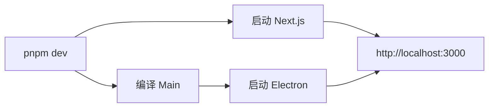
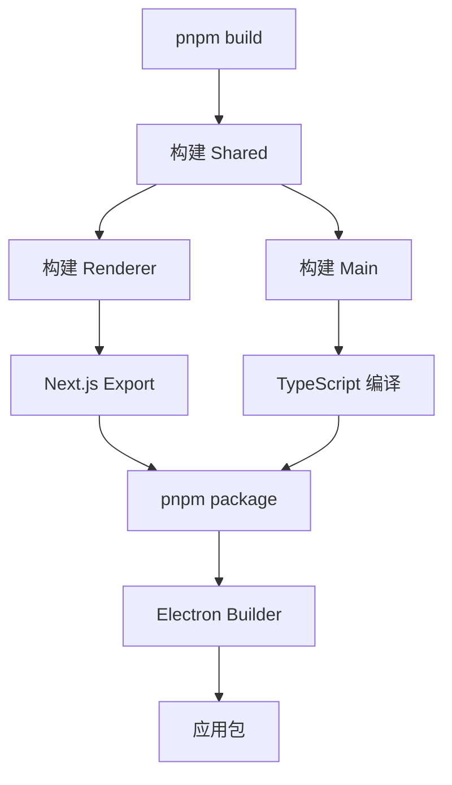

# 架构说明

本文档详细介绍项目的架构设计和实现细节。

## 📐 整体架构

### Monorepo 结构

项目采用 Monorepo 架构，使用 pnpm workspace 管理多个包：

```
electron-react-monorepo/
├── packages/
│   ├── main/       # Electron 主进程
│   ├── renderer/   # Next.js 渲染进程
│   └── shared/     # 共享代码
└── package.json    # 根配置
```

**优势：**
- 统一的依赖管理
- 代码共享更容易
- 一致的构建流程
- 更好的类型安全

### 三层架构

```
┌─────────────────────────────────────┐
│      Renderer (Next.js + React)     │
│  - UI 组件                          │
│  - 页面路由                         │
│  - 状态管理                         │
└─────────────┬───────────────────────┘
              │ IPC 通信
┌─────────────▼───────────────────────┐
│      Main (Electron 主进程)         │
│  - 窗口管理                         │
│  - 系统 API                         │
│  - IPC 处理                         │
└─────────────┬───────────────────────┘
              │
┌─────────────▼───────────────────────┐
│      Shared (共享代码)              │
│  - 类型定义                         │
│  - 常量                             │
│  - 工具函数                         │
└─────────────────────────────────────┘
```

## 🔌 进程通信

### IPC 架构

Electron 使用进程间通信（IPC）连接主进程和渲染进程：

```
┌──────────────┐                    ┌──────────────┐
│   Renderer   │                    │     Main     │
│              │                    │              │
│ ┌──────────┐ │                    │ ┌──────────┐ │
│ │electronAPI│ │ ──invoke──────────▶│ │ipcHandler│ │
│ └──────────┘ │                    │ └──────────┘ │
│              │                    │              │
│              │ ◀──response────────│              │
└──────────────┘                    └──────────────┘
       ▲                                    ▲
       │                                    │
       │          ┌──────────────┐          │
       └──────────│   Preload    │──────────┘
                  │              │
                  │ contextBridge│
                  └──────────────┘
```

### 实现细节

1. **通道定义** (`packages/shared/src/constants.ts`)
   ```typescript
   export const IPC_CHANNELS = {
     WINDOW: {
       MINIMIZE: 'window:minimize',
       MAXIMIZE: 'window:maximize',
     },
     // ...
   };
   ```

2. **预加载脚本** (`packages/main/src/preload.ts`)
   ```typescript
   contextBridge.exposeInMainWorld('electronAPI', {
     minimizeWindow: () => ipcRenderer.invoke(IPC_CHANNELS.WINDOW.MINIMIZE),
   });
   ```

3. **主进程处理器** (`packages/main/src/ipc.ts`)
   ```typescript
   ipcMain.handle(IPC_CHANNELS.WINDOW.MINIMIZE, (event) => {
     const window = BrowserWindow.fromWebContents(event.sender);
     window?.minimize();
   });
   ```

4. **渲染进程调用**
   ```typescript
   await window.electronAPI.minimizeWindow();
   ```

### 安全性

- ✅ `contextIsolation: true` - 隔离上下文
- ✅ `nodeIntegration: false` - 禁用 Node.js 集成
- ✅ 使用 `contextBridge` 暴露 API
- ✅ 验证所有 IPC 输入

## 🎨 渲染层架构

### Next.js App Router

使用 Next.js 14 的 App Router：

```
src/app/
├── layout.tsx          # 根布局
├── page.tsx            # 首页
└── about/
    └── page.tsx        # 关于页面
```

**特性：**
- 基于文件系统的路由
- 服务端组件（Server Components）
- 客户端组件（Client Components）
- 布局嵌套

### 组件层次

```
RootLayout (layout.tsx)
├── StyledComponentsRegistry
└── ThemeProvider
    └── ConfigProvider (Ant Design)
        └── Page Components
            └── UI Components
```

### 状态管理

使用 React Context 进行状态管理：

```typescript
// ThemeProvider 示例
const ThemeContext = createContext<ThemeContextType>();

export function ThemeProvider({ children }) {
  const [theme, setTheme] = useState('light');
  
  return (
    <ThemeContext.Provider value={{ theme, setTheme }}>
      {children}
    </ThemeContext.Provider>
  );
}

export const useTheme = () => useContext(ThemeContext);
```

## 💅 样式架构

### 多样式方案

项目集成了三种样式方案：

1. **Tailwind CSS** - 实用类
   ```tsx
   <div className="flex items-center justify-center p-4">
   ```

2. **Ant Design** - UI 组件
   ```tsx
   <Button type="primary">按钮</Button>
   ```

3. **styled-components** - CSS-in-JS
   ```tsx
   const Button = styled.button`
     background: blue;
   `;
   ```

### 样式隔离

```
Global Styles (globals.css)
├── Tailwind Base/Components/Utilities
├── Ant Design Themes
└── Component Styles (styled-components)
    └── Scoped to Components
```

### 主题系统

```typescript
// 主题配置
ConfigProvider
  theme={{
    algorithm: theme.darkAlgorithm,
    token: {
      colorPrimary: '#667eea',
      borderRadius: 8,
    },
  }}
```

## 🎬 动画架构

### Framer Motion 集成

```typescript
// 动画组件
<motion.div
  initial={{ opacity: 0, y: 20 }}
  animate={{ opacity: 1, y: 0 }}
  transition={{ duration: 0.5 }}
>
  内容
</motion.div>
```

### 动画层次

1. **页面过渡** - 页面级动画
2. **组件动画** - 组件进入/离开
3. **交互动画** - 用户交互反馈
4. **手势** - 拖拽、滑动等

## 📦 构建流程

### 开发模式



### 生产构建



## 🔧 TypeScript 配置

### Project References

```json
{
  "references": [
    { "path": "../shared" }
  ]
}
```

**优势：**
- 增量编译
- 更好的编辑器支持
- 强制依赖顺序

### 类型流动

```
shared/types.ts
    ↓ (import)
main/src/main.ts
    ↓ (IPC)
renderer/src/app/page.tsx
```

## 📊 数据流

### 单向数据流

```
User Action
    ↓
Component Event Handler
    ↓
IPC Call (if needed)
    ↓
Main Process Handler
    ↓
System API / File System
    ↓
Response
    ↓
State Update
    ↓
UI Re-render
```

## 🔐 安全架构

### 安全层次

1. **进程隔离**
   - 主进程和渲染进程分离
   - Context isolation

2. **API 暴露控制**
   - 只暴露必要的 API
   - 通过 preload 脚本

3. **输入验证**
   - 验证所有 IPC 输入
   - 类型检查

4. **内容安全策略**
   - CSP 头部
   - 限制外部资源

## 🚀 性能优化

### 优化策略

1. **代码分割**
   - Next.js 自动代码分割
   - 动态导入

2. **懒加载**
   ```typescript
   const HeavyComponent = lazy(() => import('./Heavy'));
   ```

3. **React 优化**
   - `React.memo`
   - `useMemo` / `useCallback`

4. **Electron 优化**
   - 预加载关键资源
   - 窗口缓存

## 🧩 扩展性

### 添加新功能

1. **新 IPC 通道**
   - 在 `shared/constants.ts` 定义
   - 在 `main/ipc.ts` 实现
   - 在 `preload.ts` 暴露

2. **新页面**
   - 在 `renderer/src/app` 创建目录
   - 添加 `page.tsx`

3. **新组件**
   - 在 `renderer/src/components` 创建
   - 导出并使用

### 最佳实践

- 保持组件小而专注
- 使用 TypeScript 类型
- 共享代码放在 shared 包
- 编写可测试的代码

---

这个架构设计注重**可维护性**、**可扩展性**和**性能**，为构建复杂的桌面应用提供了坚实的基础。
